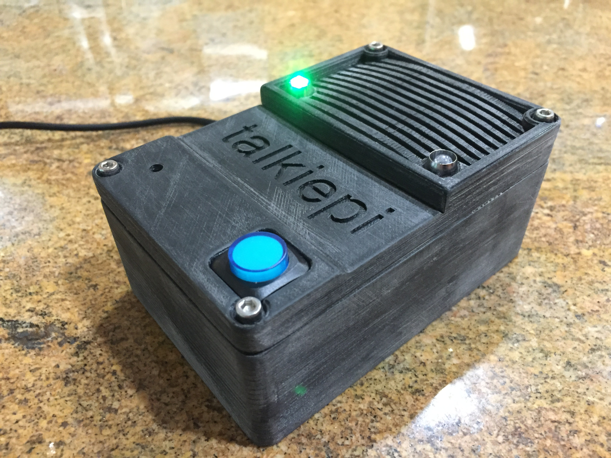

# Boot to talkiepi


This is a simple overview to scratch install talkiepi on your Raspberry Pi, and have it start on boot. 
This document assumes that you have raspbian-stretch-lite installed on your SD card, and that the distribution is up to date.
This document also asumes that you have already configured network/wifi connectivity on your Raspberry Pi.

By default talkiepi will run without any arguments, it will autogenerate a username and then connect to my mumble server.
You can change this behavior by appending commandline arguments of `-server YOUR_SERVER_ADDRESS`, `-username YOUR_USERNAME` to the ExecStart line in `/etc/systemd/system/mumble.service` once installed.

talkiepi will also accept arguments for `-password`, `-insecure`, `-certificate` and `-channel`, all defined in `cmd/talkiepi/main.go`, if you run your own mumble server, these will be self explanatory.


## Create a user

As root on your Raspberry Pi (`sudo -i`), create a mumble user:
```
adduser --disabled-password --disabled-login --gecos "" mumble
usermod -a -G cdrom,audio,video,plugdev,users,dialout,dip,input,gpio mumble
```

## Install

As root on your Raspberry Pi (`sudo -i`), install golang and other required dependencies, then build talkiepi:
```
apt-get install golang libopenal-dev libopus-dev git

su mumble

mkdir ~/gocode
mkdir ~/bin

export GOPATH=/home/mumble/gocode
export GOBIN=/home/mumble/bin

cd $GOPATH

go get github.com/dchote/gopus
go get github.com/dchote/talkiepi

cd $GOPATH/src/github.com/dchote/talkiepi

go build -o /home/mumble/bin/talkiepi cmd/talkiepi/main.go 
```


## Start on boot

As root on your Raspberry Pi (`sudo -i`), copy mumble.service in to place:
```
cp /home/mumble/gocode/src/github.com/dchote/talkiepi/conf/systemd/mumble.service /etc/systemd/system/mumble.service

systemctl enable mumble.service
```

## Create a certificate

This is optional, mainly if you want to register your talkiepi against a mumble server and apply ACLs.
```
su mumble
cd ~

openssl genrsa -aes256 -out key.pem
```

Enter a simple passphrase, its ok, we will remove it shortly...

```
openssl req -new -x509 -key key.pem -out cert.pem -days 1095
```

Enter your passphrase again, and fill out the certificate info as much as you like, its not really that important if you're just hacking around with this.

```
openssl rsa -in key.pem -out nopasskey.pem
```

Enter your password for the last time.

```
cat nopasskey.pem cert.pem > mumble.pem
```

Now as root again (`sudo -i`), edit `/etc/systemd/system/mumble.service` appending `-username USERNAME_TO_REGISTER -certificate /home/mumble/mumble.pem` at the end of `ExecStart = /home/mumble/bin/talkiepi`

Run `systemctl daemon-reload` and then `service mumble restart` and you should be set with a tls certificate!


## Use your USB speakerphone

If you are using a USB speakerphone such as the US Robotics one that I am using, you will need to change the default system sound device.
As root on your Raspberry Pi (`sudo -i`), find your device by running `aplay -l`, take note of the index of the device (likely 1) and then edit the alsa config (`/usr/share/alsa/alsa.conf`), changing the following:
```
defaults.ctl.card 1
defaults.pcm.card 1
```
_1 being the index of your device_


If your speakerphone is too quiet, you can adjust the volume using amixer as such:
```
amixer -c 1 set Headphone 60%
```
_1 being the index of your device_


## Pi Zero Fixes
I have compiled libopenal without ARM NEON support so that it works on the Pi Zero. The packages can be found in the [workarounds](/workarounds/). directory of this repo, install the libopenal1 package over your existing libopenal install.
